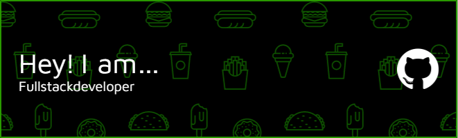

# Hi there I´m Carlos, *A Full Stack Software Developer!* :wave:

### About me!, *click below* 

  
Click here!

  
 * ***Innovative and forward-thinking:*** When working on group coding tasks, predicted various possible issues, which enabled the team to prevent those problems before they arose. 
 * ***Resilient and adaptable:*** Have lived in various countries, such as Germany, Italy and Ireland, where I adapted to different cultures and languages, and thrived in new environments.
* ***Languages:*** Spanish (Native), English (C1), Italian (B1)
*	***Team worker:*** Have been a key member of various companies and Henry Bootcamp Coding Group, where my skills were recognised and felt like an important contributor to my team.
 
 * ✉️  You can contact me at [carlosvazqueznosetto@gmail.com](mailto:carlosvazqueznosetto@gmail.com)
  

<!--
**neleon10/neleon10** is a ✨ _special_ ✨ repository because its `README.md` (this file) appears on your GitHub profile.

Here are some ideas to get you started:

- 🔭 I’m currently working on ...
- 🌱 I’m currently learning ...
- 👯 I’m looking to collaborate on ...
- 🤔 I’m looking for help with ...
- 💬 Ask me about ...
- 📫 How to reach me: ...
- 😄 Pronouns: ...
- ⚡ Fun fact: ...
-->

